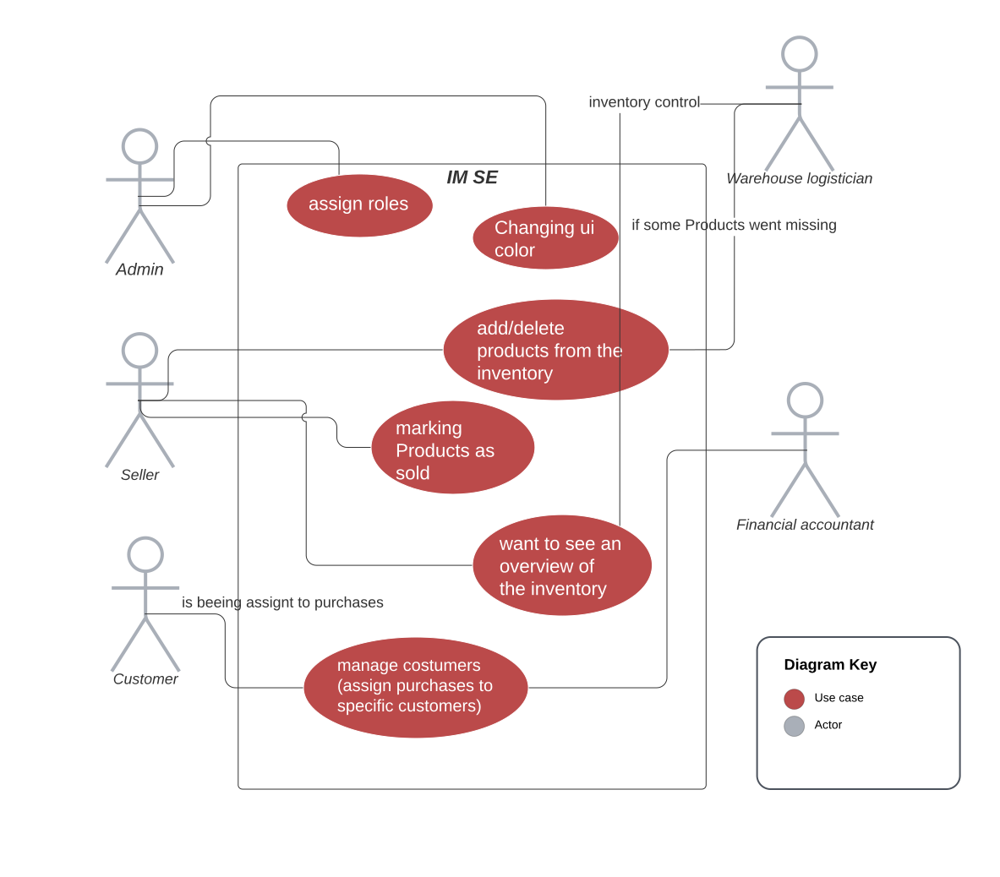

# Inventory Management System Enterprise (IM SE)
 - Software Requirements Specification 

## Table of contents
- [Table of contents](#table-of-contents)
- [Introduction](#1-introduction)
    - [Purpose](#11-purpose)
    - [Scope](#12-scope)
    - [Definitions, Acronyms and Abbreviations](#13-definitions-acronyms-and-abbreviations)
    - [References](#14-references)
    - [Overview](#15-overview)
- [Overall Description](#2-overall-description)
    - [Vision](#21-vision)
    - [Use Case Diagram](#22-use-case-diagram)
	- [Technology Stack](#23-technology-stack)
- [Specific Requirements](#3-specific-requirements)
    - [Functionality](#31-functionality)
    - [Usability](#32-usability)
    - [Reliability](#33-reliability)
    - [Performance](#34-performance)
    - [Supportability](#35-supportability)
    - [Design Constraints](#36-design-constraints)
    - [Online User Documentation and Help System Requirements](#37-on-line-user-documentation-and-help-system-requirements)
    - [Purchased Components](#purchased-components)
    - [Interfaces](#39-interfaces)
    - [Licensing Requirements](#310-licensing-requirements)
    - [Legal, Copyright And Other Notices](#311-legal-copyright-and-other-notices)
    - [Applicable Standards](#312-applicable-standards)
- [Supporting Information](#4-supporting-information)

### 1.1 Purpose
This Software Requirements Specification (SRS) describes all specifications for the application “IM SE”. It includes an overview about this project and its vision, detailed information about the planned features and boundary conditions of the development process.

### 1.2 Scope
The project is going to be realized as a desktop application.

Planned Subsystems are: 
* Scanner:  
detect and add products using an externally connected scanner
* Export:  
inventory or individual product groups can be exported as .csv file
* User roles:  
permissions of individual user groups can be regulated individually
* Corporate design:  
individualization of the user interface to match the company color and logo
* Customer management:  
customers and suppliers can be created and managed

### 1.3 Definitions, Acronyms and Abbreviations
| Abbrevation | Explanation                            |
| ----------- | -------------------------------------- |
| SRS         | Software Requirements Specification    |
| UC          | Use Case                               |
| n/a         | not applicable                         |
| tbd         | to be determined                       |
| UCD         | overall Use Case Diagram               |

### 1.4 References

| Title                                                              | Date       | Publishing organization   |
| -------------------------------------------------------------------|:----------:| ------------------------- |
| [Framgång Blog](https://dhbwse.wordpress.com/blog/)                | 06.10.2022 | Framgång Team             |
| [GitHub](https://github.com/jan-nie/dhbw-software-engineering)     | 06.10.2022 | Framgång Team             |

### 1.5 Overview
The following chapter provides an overview of this project with vision and Overall Use Case Diagram. The third chapter (Requirements Specification) delivers more details about the specific requirements in terms of functionality, usability and design parameters. Finally, there is a chapter with supporting information.

## 2. Overall Description

### 2.1 Vision
Our team develops an inventory management system using the Java programming language, which allows it to be used on most common operating systems. Our modular programming approach focuses on inventory management. On the one hand, goods can be recorded and categorized. On the other hand, specific attributes are assigned to each product, such as storage location, quantity or price. In order to ensure a consistent data set on the various devices, synchronization takes place via a mongoDB, which is available in the cloud.
Modular programming allows the scope of the software to be expanded in an arbitrary and agile manner. It also makes it easier to divide up tasks within the team.

### 2.2 Use Case Diagram 

- Red: Use case
- Grey: Actor

### 2.3 Technology Stack
The technology we use is:

Backend:
-Gradle and Springboot
-H2 Database

Frontend:
-Java and FXML

IDE:
-Eclipse

Project Management:
-YouTrack
-GitHub
-Discord

Testing:
-JUnit

## 3. Specific Requirements

### 3.1 Functionality
This section will explain the different use cases, you could see in the Use Case Diagram, and their functionality.  
- 3.1.1 Inventory management
- 3.1.2 User role management
- 3.1.3 Customer management
- 3.1.4 Sell process
- 3.1.5 Changing UI settings

#### 3.1.1 Inventory management
This function is the essence of our project. The authorized user gets the possibility to manage the products. This includes creating new products, changing product specific properties and deleting products. 

[Inventory management](../use_cases/uc1_inventory_management.md)

#### 3.1.2 Overview products
This feature provides a basic overview over all current sessions. All posted sessions are added here. From this overview you can select a session and from there join this session.

[Session overview](./use_cases/UC2_Session_Overview.md)

#### 3.1.3 User role management
To identify all useres we need an account system. This account system enables us to build important functions such as joining a session, leaving a session or a personalized overview over all sessions (Keeping track of your sessions).

#### 3.1.4 Customer management
The app will provide the possibility to register and log in. This will also make the usability easier when a user wants to manage his sessions, post or join a session because they don't have to enter their mail address every time.

#### 3.1.5 Sell process
In case you share your phone, have multiple accounts or just want to be cautius about your privacy you should be able to manually log out.

[Logout](./use_cases/UC5_Logout.md)

#### 3.1.6 Changing UI settings
There is also the possibility to join an existing game session. Therefore, the user can select a specific session.

[Join a session](./use_cases/UC6_Join_Session.md)

### 3.2 Usability
We plan on designing the user interface as intuitive and self-explanatory as possible to make the user feel as comfortable as possible using the app. Though an FAQ document will be available, it should not be necessary to use it.

### 3.3 Reliability

#### 3.3.1 Availability
Due to the fact that productive work is not possible if the server is not accessible, an up-time of at least 99% should be guaranteed. This is guaranteed by the provider MongoDB, which provides a backup server.

### 3.4 Perfomance

#### 3.4.1 Capacity
The system should be able to manage hundreds of requests. Also it should be possible to register as many users as necessary and all products. 

#### 3.4.2  Response time
To provide the best perfomance we aim to keep the response time as low as possible. This will make the user experience much better.

### 3.5 Supportability

#### 3.5.1 Coding Standards
We are going to write the code by using all of the most common clean code standards. For example we will name our variables and methods by their functionalities. This will keep the code easy to read by everyone and make further developement much easier.

#### 3.5.2 Testing Strategy
The application will have a high test coverage and all important functionalities and edge cases should be tested. Further mistakes in the implementation will be discovered instantly and it will be easy to locate the error. 

### 3.6 Design Constraints
We are trying to provide a modern and easy to handle design for the UI aswell as for the architecture of our application. To achieve that the functionalities will be kept as modular as possible.

The supported Platforms will be:
- Java 17 and higher

### 3.7 Purchased Components
We don't have any purchased components yet. If there will be purchased components in the future we will list them here.

### 3.8 Interfaces

#### 3.8.1 User Interfaces
The User interfaces that will be implented are:
- Dashboard - overview of important informations
- Login - this page is used to log in 
- Register - provides a registration form (can be used by Admin)
- Inventory Overview - lists all products and their essential data
- Settings - shows the settings
- Supplier - lists all suppliers and their essential data

#### 3.8.2 Hardware Interfaces
(n/a)

#### 3.8.3 Software Interfaces
The application will be runnable on Java 17 and higher.  

### 3.9 Licensing Requirements

### 3.10 Applicable Standards
The development will follow the common clean code standards and naming conventions. 

## 4. Supporting Information
For any further information you can contact us or check our [Blog](https://dhbwse.wordpress.com/blog/). 
The Team Members are:
- Jan Niederhoefer
- Dominik Fuchs
- Mika Wohlfart
- Marius Hoffmann
- Nicolai Eisenstein

<!-- Picture-Link definitions: -->
