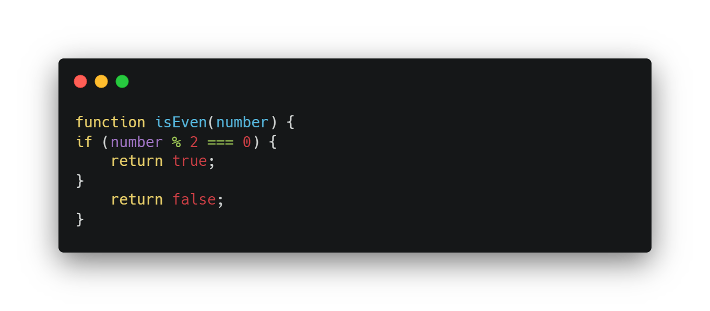
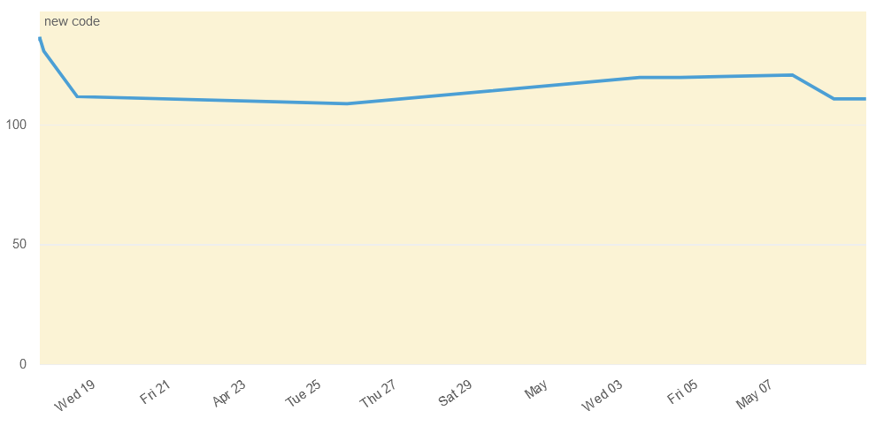
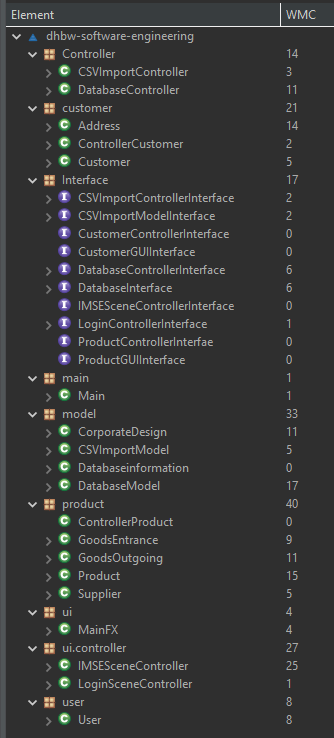
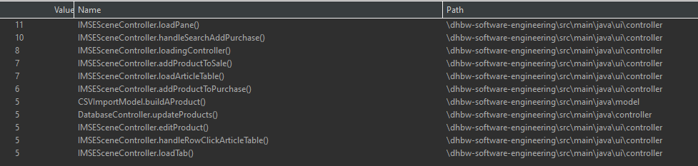
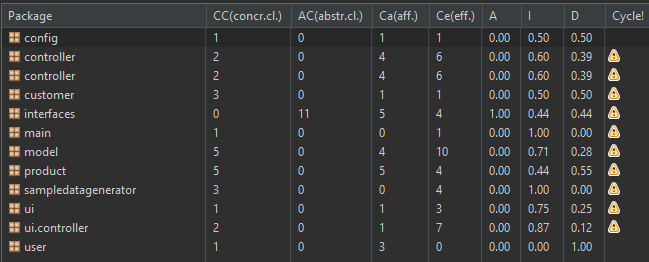
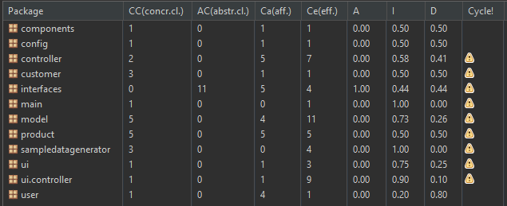

# Metrics
In today’s lecture, we studied the topic of coupling in detail. Below you will find our presentation on this topic:
[slides.pdf](https://dhbwse.files.wordpress.com/2023/05/coupling.pdf)

In this blog post, we want to introduce you to three metrics that we want to measure as part of our software project.
 
 

## Source Code Complexity
Source Code Complexity is an important aspect of software development. High complexity can affect the maintainability, readability and efficiency of the code. In this post, we will take a closer look at the definition of Source Code Complexity, Cyclomatic Complexity and an example.
 
 

**Definition of Source Code Complexity**  
Source Code Complexity refers to the difficulty of making code understandable and maintainable. There are several factors that can contribute to code complexity, such as the number of lines of code, the number of branches, the number of loops, and the number of conditions.
 
 

**Cyclomatic Complexity**  
The Cyclomatic Complexity is a metric for measuring the complexity of code. This metric is based on the number of independent paths through the code. Cyclomatic Complexity is an important metric because it gives an indication of the number of test cases needed to achieve complete coverage of the code. The higher the Cyclomatic Complexity, the more difficult it becomes to test all possible paths in the code.
 
 

**Calculation of the Cyclomatic Complexity**  
The Cyclomatic Complexity can be calculated by the number of decisions in the code. Decisions can be IF statements, loops and switch statements. The formula for calculating Cyclomatic Complexity is:

`M = E – N + 2`

Where M is the Cyclomatic Complexity, E is the number of edges in the graph of the code, and N is the number of nodes in the graph of the code.
 
 

**Example of Cyclomatic Complexity**  
Let’s look at an example:

This code has a Cyclomatic Complexity of 2 because it contains a decision (IF statement). There are two possible paths through the code: one if the condition is true, and one if the condition is false.
 
 

The current metric on Cyclomatic Complexity can be seen in the following graph. This shows that as the code base increases, the Cyclomatic Complexity also increases, which is due to the growing number of different branches. However, the metric could be optimized a little by making adjustments to the code.

 
 
 
 

**Weighted Methods per Class (WMC)**  
Weighted Methods per Class (WMC) is a software metric that measures the complexity of a class. It is calculated by summing the cyclomatic complexities of all the methods in the class. The cyclomatic complexity of a method is a measure of the number of independent paths through the method. A higher WMC value indicates a more complex class, which may require more time and effort to develop and maintain.
 
 

WMC is one of the most commonly used software metrics. It is a useful metric for identifying complex classes, which may be candidates for refactoring. Refactoring is a technique for improving the design of code without changing its functionality. By refactoring complex classes, developers can improve the maintainability and readability of their code.
 
 

**Calculation of the WMC**  
There are a few limitations to WMC. First, it is a static metric, which means that it is calculated from the source code of a class. It does not take into account the dynamic behavior of the class. Second, WMC is a single metric, which does not provide a complete picture of the complexity of a class. Other metrics, such as coupling and cohesion, can be used to provide a more complete picture of class complexity.

<table style="width: 100%; border-collapse: collapse; border: none;">
  <tr>
    <td>WMC April 2023</td>
    <td>WMC June 2023</td>
  </tr>
  <tr>
    <td></td>
    <td></td>
  </tr>
</table>

As our project has progressed, a considerable number of new classes have been developed. Alongside this expansion, numerous features have been incorporated into these classes, resulting in a significant increase in complexity. Moreover, it has come to our attention that a few classes served as 'dummy' classes, meaning they either lacked substantial content or failed to provide any meaningful value to the project
 
 
 
 

## Coupling
As a third Metric we used coupling. Coupling is the degree of interdependence between software modules. It is a measure of how closely connected two routines or modules are.

Low coupling is generally considered to be better than high coupling, as it makes the software more modular and easier to maintain. This is because changes to one module are less likely to affect other modules when coupling is low.

There are a number of things that can be done to reduce coupling, such as:

- Using interfaces and abstract classes to decouple modules.
- Passing parameters instead of sharing global variables.
- Encapsulating data and functions.
- Using dependency injection to inject dependencies into modules instead of hardcoding them.

By reducing coupling, software engineers can create more modular and maintainable software systems.

If you want to gather even more information about coupling feel free to look at our slides that are linked at the beginning.

The table shows the results of our coupling analysis for different packages of our Java application. Analysis of the table shows that some packages have high dependency (Ca and Ce) on other packages, while other packages have a low dependency.

For example, the “interfaces” package has 11 afferent Couplings (Ca), it was pointed out that many other packages depend on this package. However, it only has 4 efferents Couplings (Ce), it has been pointed out that it is less dependent on other packages. This makes the “Interfaces” package a central part of the application.

Another interesting example is the ui.controller package. It has a high Efferent Coupling (Ce) count, suggesting that it depends on many other packages. At the same time, it has high instability (I) and a large distance from the main sequence (D). This indicates that the package is prone to change.

It is important to note that the interpretation of the coupling metrics depends heavily on the context and needs of the application. Some applications may require higher coupling between certain packages, while in other cases loose coupling is preferred.

In the picture below you can see the new evaluation of the coupling of our project. You can see that the package "components" has been added and except for minimal changes of one value there are no differences to the old state. So we have maintained our quality despite the new code, because the coupling of the packages has not increased. 

