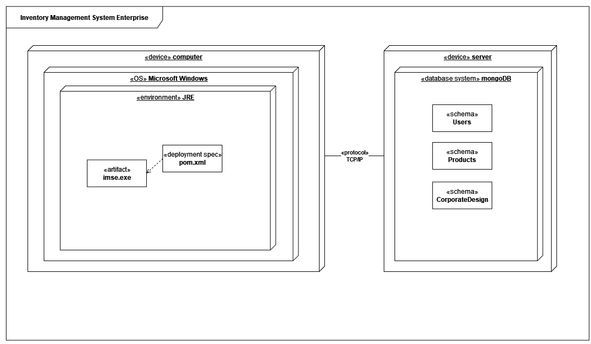
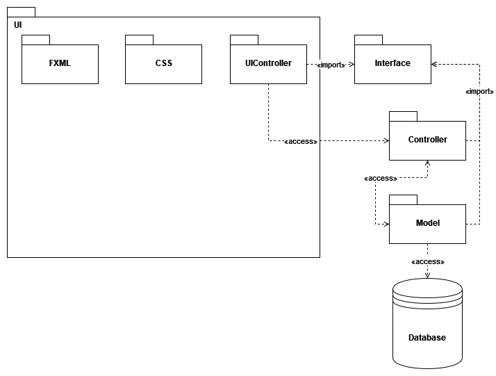

# Inventory Management System Enterprise (IM SE)
 - Software Architecture Document

## Table of contents
- [Table of contents](#table-of-contents)
- [Introduction](#1-introduction)
    - [Purpose](#11-purpose)
    - [Scope](#12-scope)
    - [Definitions, Acronyms and Abbreviations](#13-definitions-acronyms-and-abbreviations)
    - [References](#14-references)
    - [Overview](#15-overview)
- [Architectural Representation](#2-architectural-representation)
- [Architectural Goals and Constraints](#3-architectural-goals-and-constraints)
- [Use-Case View](#4-use-case-view)
   - [Use-Case Realizations](#41-use-case-realization)
- [Logical View](#5-logical-view)
   - [Overview](#51-overview)
   - [Architecturally Significant Design Packages](#52-architecturally-significant-design-packages)
- [Process View](#6-process-view)
- [Deployment View](#7-deployment-view)
- [Implementation View](#8-implementation-view)
   - [Overview](#81-overview)
   - [Layers](#82-layers)
- [Data View](#9-data-view)
- [Size and Performance](#10-size-and-performance)
- [Quality](#11-quality)

## 1. Introduction
[The introduction of the Software Architecture Document provides an overview of the entire Software Architecture Document. It includes the purpose, scope, definitions, acronyms, abbreviations, references, and overview of the Software Architecture Document.]
### 1.1 Purpose
This document provides a comprehensive architectural overview of the system, using a number of different architectural views to depict different aspects of the system. It is intended to capture and convey the significant architectural decisions which have been made on the system.

[This section defines the role or purpose of the Software Architecture Document, in the overall project documentation, and briefly describes the structure of the document. The specific audiences for the document is identified, with an indication of how they are expected to use the document.]

### 1.2 Scope
[A brief description of what the Software Architecture Document applies to; what is affected or influenced by this document.]

### 1.3 Definitions, Acronyms and Abbreviations
| Abbrevation | Explanation                            |
| ----------- | -------------------------------------- |
| SRS         | Software Requirements Specification    |
| UC          | Use Case                               |
| n/a         | not applicable                         |
| tbd         | to be determined                       |
| UCD         | overall Use Case Diagram               |
| FAQ         | Frequently asked Questions             |
[This subsection provides the definitions of all terms, acronyms, and abbreviations required to properly interpret the Software Architecture Document.  This information may be provided by reference to the project’s Glossary.]

### 1.4 References

| Title                                                               | Date       | Publishing organization   |
| --------------------------------------------------------------------|:----------:| ------------------------- |
| [Framgång Blog](https://dhbwse.wordpress.com/blog/)                 | 06.10.2022 | Framgång Team             |
| [GitHub](https://github.com/jan-nie/dhbw-framgang)                  | 06.10.2022 | Framgång Team             |
[This subsection provides a complete list of all documents referenced elsewhere in the Software Architecture Document. Identify each document by title, report number (if applicable), date, and publishing organization. Specify the sources from which the references can be obtained. This information may be provided by reference to an appendix or to another document.]

### 1.5 Overview
[This subsection describes what the rest of the Software Architecture Document contains and explains how the Software Architecture Document is organized.]
    
## 2. Architectural Representation
[This subsection describes what the rest of the Software Architecture Document contains and explains how the Software Architecture Document is organized.]

## 3. Architectural Goals and Constraints
[This section describes the software requirements and objectives that have some significant impact on the architecture; for example, safety, security, privacy, use of an off-the-shelf product, portability, distribution, and reuse. It also captures the special constraints that may apply: design and implementation strategy, development tools, team structure, schedule, legacy code, and so on.]

## 4. Use-Case View
This section lists use cases or scenarios from the use-case model if they represent some significant, central functionality of the final system, or if they have a large architectural coverage—they exercise many 
architectural elements or if they stress or illustrate a specific, delicate point of the architecture.]

### 4.1 Use-Case Realizations
[This section illustrates how the software actually works by giving a few selected use-case (or scenario) realizations, and explains how the various design model elements contribute to their functionality.]
Use Case: inventory management [here](./use_cases/uc1_inventory_management.md)
Use Case: user role management [here](./use_cases/uc2_user_role_management.md)
Use Case: sell process [here](./use_cases/uc3_sell_process.md)
Use Case: changing ui [here](./use_cases/uc4_changing_ui_settings.md)

## 5 Logical View
[This section describes the architecturally significant parts of the design model, such as its decomposition into subsystems and packages. And for each significant package, its decomposition into classes and class utilities. You should introduce architecturally significant classes and describe their responsibilities, as well as a few very important relationships, operations, and attributes.]
we put the focus on the interfaces. Here we agreed on the MVC model as the architectural basis. All communication takes place via specially defined interfaces. For example, each of our controllers communicates with the view via interfaces.

### 5.1 Overview
[This subsection describes the overall decomposition of the design model in terms of its package hierarchy and layers.]
Class diagram [here](./week5/classdiagram.md)

### 5.2 Architecturally Significant Design Packages
[For each significant package, include a subsection with its name, its brief description, and a diagram with all significant classes and packages contained within the package. 
For each significant class in the package, include its name, brief description, and, optionally, a description of some of its major responsibilities, operations, and attributes.]

## 6 Process View
[This section describes the system's decomposition into lightweight processes (single threads of control) and heavyweight processes (groupings of lightweight processes). Organize the section by groups of processes that communicate or interact. Describe the main modes of communication between processes, such as message passing, interrupts, and rendezvous.]
Sequence digramm: user role management [here](./use_cases/Sequenz_Diagram_User_Role_Management.png)
The administrator has the option of creating a new user or adjusting the rights of an existing user. The distribution of rights is done via already defined presets (i.e. a buyer needs the rights to see the stock of goods, but is not allowed to change it). The consistency of the data is ensured via a database. 
Sequence digramm: inventory management [here](./use_cases/sequenzDiagram_inventory.png)
The buyer can open the required window via the GUI and can create products there. The data entered is checked for correctness in the controller and then written to the database. 
Sequence digramm: sell process [here](./use_cases/SequenceDiagramSale2.jpg)
A salesperson can create sales orders via the GUI. The goods are displayed together with the stock. He can then enter the desired quantities and save the order. This order is validated in the controller. If the validation is successful, the stock is updated in the database and the order is saved. 

## 7 Deployment View
Deployment diagram:

## 8 Implementation View
Package diagram:

### 8.1 Overview
tbd

### 8.2 Layers
tbd

## 9 Data View
Database ER-Diagram:
[here](./)

## 10 Size and Performance
As indicated in the project vision, we are developing the software for desktop devices with the common operating systems Windows, Linux and macOS. On the other hand, porting to portable devices such as tablets and smartphones running iOS and Android is not planned.
We also use multiple threads for parallel task processing. While the user interacts with the software, background processes are running, which concern availability, for example (see Section 11).

## 11 Quality
We rely on three eminent tactics for the quality feature Availability: 
- Detect Faults: One of the most important functions is the ping/echo test, whereby the database server is pinged at regular intervals in the background to check availability. In addition, all warnings, error messages and exception outputs are saved in a log file.
- Recover from Faults: If the internet connection fails, entered data is cached locally and synchronized with the database at the next opportunity.
- Prevent Faults: User input is processed as part of sanity checking. Data types are checked and adjusted if necessary, and the connection to the database is made exclusively using the interfaces to prevent SQL injections.

<!-- Picture-Link definitions: -->
[OUCD]: https://github.com/IB-KA/CommonPlayground/blob/master/UseCaseDiagramCP.png "Overall Use Case Diagram"
