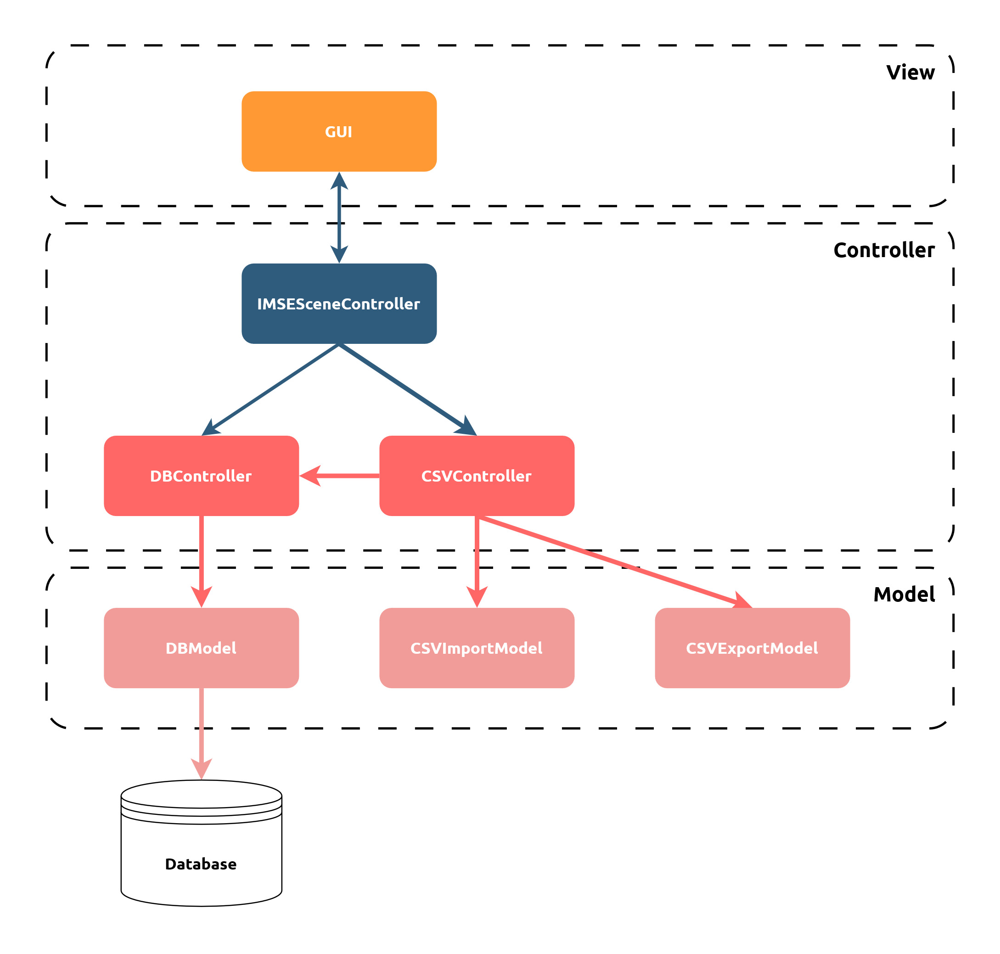
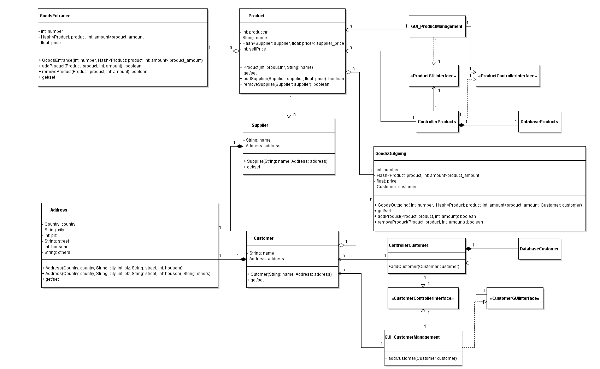
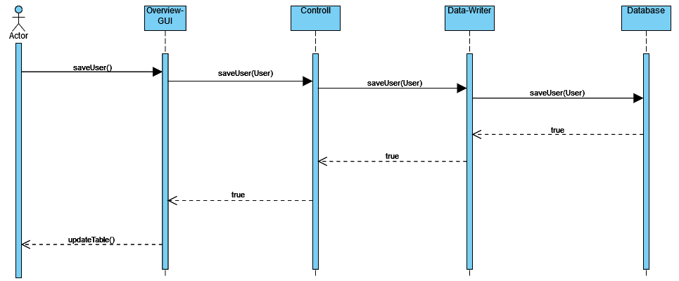
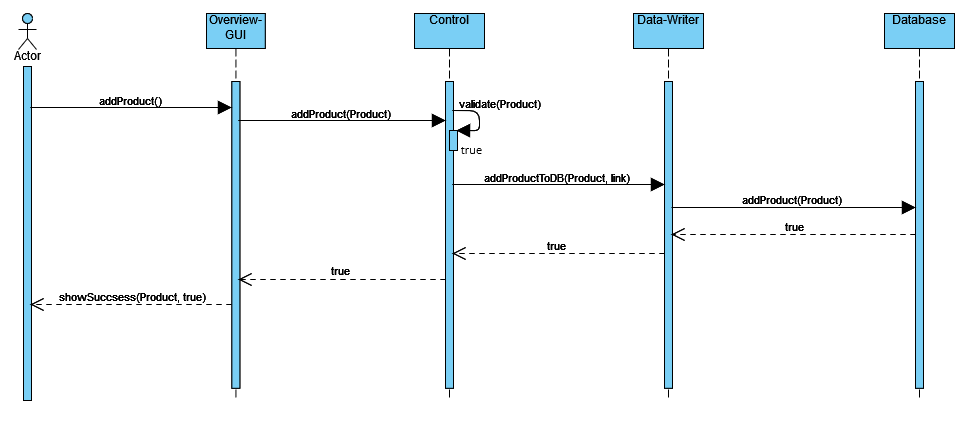
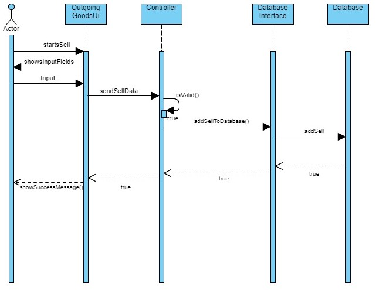
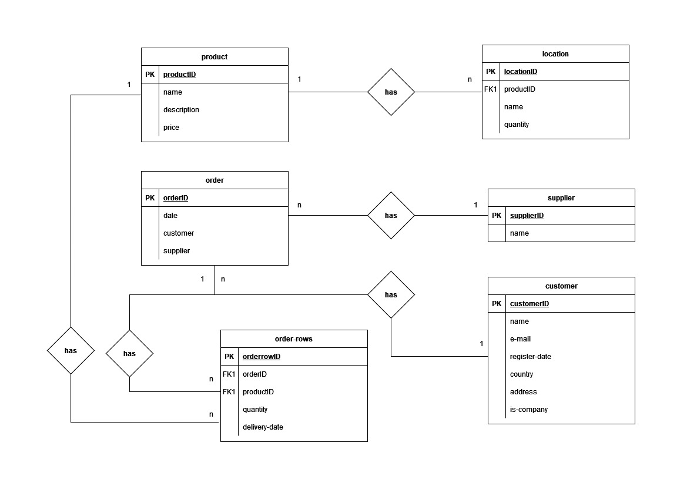

# Inventory Management System Enterprise (IMSE)
# Software Architecture Document

## Table of contents
- [Table of contents](#table-of-contents)
- [Introduction](#1-introduction)
    - [Purpose](#11-purpose)
    - [Scope](#12-scope)
    - [Definitions, Acronyms and Abbreviations](#13-definitions-acronyms-and-abbreviations)
    - [References](#14-references)
    - [Overview](#15-overview)
- [Architectural Representation](#2-architectural-representation)
- [Architectural Goals and Constraints](#3-architectural-goals-and-constraints)
    - [Security](#31-security)
    - [Persistence](#32-persistence)
    - [Distribution](#33-distribution)
- [Use-Case View](#4-use-case-view)
   - [Use-Case Realizations](#41-use-case-realizations)
- [Logical View](#5-logical-view)
- [Process View](#6-process-view)
- [Deployment View](#7-deployment-view)
- [Implementation View](#8-implementation-view)
- [Data View](#9-data-view)
- [Size and Performance](#10-size-and-performance)
- [Quality](#11-quality)
   
   

## 1. Introduction
### 1.1 Purpose
This document provides a comprehensive architectural overview of the system, using a number of different architectural views to depict different aspects of the system. It is intended to capture and convey the significant architectural decisions which have been made on the system.
   
   

### 1.2 Scope
The goal of this SAD is to show the architecture of our inventory management program, which we implemented as a desktop application. We show an overview of our use cases and classes.
   
   

### 1.3 Definitions, Acronyms and Abbreviations
| Abbrevation | Explanation                            |
| ----------- | -------------------------------------- |
| SRS         | Software Requirements Specification    |
| UC          | Use Case                               |
| n/a         | not applicable                         |
| tbd         | to be determined                       |
| UCD         | overall Use Case Diagram               |
   
   

### 1.4 References

| Title                                                               | Date       | Publishing organization   |
| --------------------------------------------------------------------|:----------:| ------------------------- |
| [Framgång Blog](https://dhbwse.wordpress.com/blog/)                 | 06.10.2022 | Framgång Team             |
| [GitHub](https://github.com/jan-nie/dhbw-framgang)                  | 06.10.2022 | Framgång Team             |
   
   

### 1.5 Overview
This software architecture document is divided into 11 chapters and provides information about the architecture, goals and constraints, among other things. Other important points are logical view, deployment, implementation and data views.
   
   

## 2. Architectural Representation
The Model-View-Controller (MVC) pattern is widely used in software development to organize applications in a modular and maintainable manner. It divides the application into three distinct components:

- **Model**:  
The Model component represents the application's data and business logic. It manages data manipulation, validation, and storage. By encapsulating the data structure and operations, the Model ensures data integrity and interacts with databases or other data sources.
   

- **View**:  
The View component focuses on presenting data to the user. It defines the user interface elements necessary for data display and retrieval. The View retrieves data from the Model and renders it in a user-friendly format, such as web pages or mobile app screens.
   

- **Controller**:  
The Controller acts as an intermediary between the Model and View. It handles user input, translates it into actions, and updates the Model or View accordingly. The Controller ensures that user input is validated and processed correctly. It also synchronizes the Model and View, reflecting changes in one component to the other.
   

Implementing the MVC pattern brings numerous benefits, including maintainability, code reusability, and testability. It allows developers to work on different parts of the application independently, making it easier to modify and extend the codebase. In our project, we utilize interfaces for communication between the View and Controllers, ensuring a flexible and decoupled architecture. The Controllers interact with the Models through direct access, enabling seamless data manipulation and processing.  

The following graphic illustrates the implementation of the MVC model in our project.  
   

   

In our software project, we employed the MVC (Model-View-Controller) architectural pattern to establish a clear and distinct structure for our functionalities. The View component utilizes FXML files to design an intuitive and responsive graphical user interface. Within the Controller component, we have implemented various classes such as the IMSESceneController, responsible for managing interactions between the View and Model, the DBController, which handles the database connection and operations, and the CSVController, dedicated to importing and exporting data in the CSV format.

The Model comprises several classes, including the DBModel, which defines the structure and operations of the database, the CSVImportModel, designed to facilitate the import of data from CSV files, and the CSVExportModel, allowing for the export of data in CSV format. These Model classes encapsulate the business logic and data processing functionalities.

Furthermore, our software project incorporates a database for persistent data storage. Leveraging the MVC model, we ensure a clear separation of responsibilities and enhance code reusability. This division of the MVC model effectively contributes to the overall modularity, maintainability, and extensibility of our application.  

You can find more information at the following link: [Architecture Significant Requirements \(ASR\)](../asr/asr.md#22-design-patterns)
   
   

## 3. Architectural Goals and Constraints
### 3.1 Security 
The security of the system is a critical aspect that must be ensured to protect the integrity and confidentiality of the data. The application incorporates essential security measures to prevent unauthorized access and manipulation of data.

- **Authentication**  
    Authentication is enforced through a login process that requires users to provide a username and password. This ensures that only authorized individuals can access the system, adding an extra layer of protection.

- **Authorization**  
    Authorization is implemented based on user profiles, such as administrator or warehouse logistician. Users are granted specific permissions according to their assigned roles, allowing them to perform relevant actions while restricting unauthorized actions.

- **Confidentiality**  
    For internet access, the system imposes mandatory security requirements. Confidentiality is maintained by encrypting sensitive data, including all user data stored in the database. This encryption safeguards the information even if unauthorized access to the database occurs.

- **Data integrity**  
    Data integrity is a crucial aspect and the system ensures that data sent across the network cannot be modified or tampered with. This prevents the risk of unauthorized alterations during transmission.

- **Auditing**  
    To enhance security further, the system includes auditing capabilities. All sensitive actions are logged, allowing for accountability and the ability to track any suspicious activities.

   
   

### 3.2 Persistence
Data persistence is addressed by utilizing a non-relational database. This choice of database technology allows for efficient storage and retrieval of data while accommodating the specific requirements of the system.  

The availability of the system is crucial, as it serves as a management tool for the sale of goods of other companies. Various tactics are employed to ensure the availability of the system, which are detailed in [Chapter 11](#11-quality) of this document. These tactics aim to minimize downtime and ensure continuous access to the system for users.
   
   

### 3.3 Distribution
The Inventory Management System Enterprise software is distributed through our key account managers using a face-to-face policy. Interested companies can directly engage with our account managers to discuss and negotiate the license conditions. This approach allows for personalized interactions and ensures that the software is tailored to meet the specific needs of each client.
   
   

## 4. Use-Case View
The Use-Case View chapter provides an overview of the system's functionality from a user's perspective. It presents four key use cases that outline specific interactions and goals within the software application.  

Use Case 1 focuses on inventory management, demonstrating how users can effectively manage and track available products or resources. Use Case 2 addresses user role management, showcasing the ability to assign and modify user roles and permissions within the system. Use Case 3 delves into the sell process, outlining the steps involved in initiating and completing a sale transaction. Lastly, Use Case 4 highlights the capability to change the user interface (UI) to accommodate customization preferences or optimize user experience.  
   
   

### 4.1 Use-Case Realizations
- Use Case 1: [inventory management](../srs/use_cases/uc1_inventory_management.md)
- Use Case 2: [user role management](../srs/use_cases/uc2_user_role_management.md)
- Use Case 3: [sell process](../srs/use_cases/uc3_sell_process.md)
- Use Case 4: [changing ui](../srs/use_cases/uc4_changing_ui_settings.md)
   
   

## 5 Logical View
In the logical view of our system, we prioritize the utilization of interfaces. We have chosen the Model-View-Controller (MVC) model as the foundational architecture, serving as a guiding principle for our design approach. This ensures that all communication between different components occurs exclusively through well-defined interfaces. As an example, each of our controllers establishes communication with the corresponding view components through interfaces.

To provide a comprehensive visual representation of this logical view, we employ a class diagram. This diagram depicts the structure and relationships of the classes within our system, highlighting the interfaces that facilitate communication between different components. By adhering to the MVC model and emphasizing the use of interfaces, our logical view promotes modularity, code reusability, and ease of maintenance within our software project.  

The overview of all already existing classes can be found in the following graphic:
   

   
   

## 6 Process View
### 6.1 Sequence diagram: User Role Management
   

   
In our system, the administrator has the authority to create new users or modify the access rights of existing users. To simplify this process, we have implemented pre-defined presets that dictate the specific rights granted to each user role. For example, a buyer may be granted access to view the stock of goods but not allowed to make any changes to it. This approach ensures consistency and uniformity in the distribution of rights across the system.  
   
   
To maintain data integrity and consistency, we rely on a reliable database. The database serves as a central repository for storing and managing user information and access rights. By storing the data in a structured and organized manner, we can enforce security measures and ensure that the assigned access rights are accurately reflected throughout the system. This ensures that users can perform their designated tasks while maintaining the integrity and security of the system's data.
   
   
   

### 6.2 Sequence diagram: Inventory Management
   

   
In the sequence diagram, the buyer initiates the process by opening the necessary window through the graphical user interface (GUI). Within this window, the buyer has the capability to create new products. Once the buyer enters the product details, the controller component comes into action. The controller validates the data entered by the buyer, ensuring its correctness and adherence to any defined constraints or business rules.  
   
   
Upon successful validation, the controller proceeds to write the product information to the database. This involves interacting with the database component to perform the necessary database operations, such as inserting the new product record. By writing the data to the database, the information becomes persistently stored, ensuring its availability for future retrieval and use.  
   
   
The sequence diagram illustrates the flow of interactions between the buyer, GUI, controller, and database components, highlighting the steps involved in creating products within the system. If successful, a corresponding message is returned and displayed in the GUI.  
   
   
   

### 6.3 Sequence diagram: Sell Process
   

   
The sequence diagram depicts the process by which a salesperson can create sales orders through the graphical user interface (GUI). Initially, the goods are displayed along with their corresponding stock levels. The salesperson can then enter the desired quantities and save the order. The controller component validates the order, and upon successful validation, updates the stock in the database and saves the order.  
   
   
The sequence begins with the salesperson accessing the GUI function to create a sales order. The GUI provides the salesperson with up-to-date information on available goods and their stock levels. The salesperson enters the desired quantities and triggers the order's storage.  
   
   
The controller takes charge of validating the order, performing checks for plausibility, availability of goods, and other business rules. If the validation is successful, the stock is updated in the database to reflect the reserved goods for the order. Simultaneously, the order itself is saved in the database to ensure comprehensive documentation.
   
   
   

## 7 Deployment View
The enclosed Deployment diagram illustrates the deployment configuration of our software system, showcasing the interaction between two components. Firstly, the Java Runtime Environment (JRE) is depicted as part of the Windows operating system, which is in turn hosted on a computer device. The deployment artifact, represented by the executable resulting from our development efforts, is executed within the JRE. Secondly, the MongoDB database system is portrayed as part of a server device. The diagram highlights the connection between these two parts using the TCP/IP protocol, representing the communication channel for data exchange. This Deployment diagram provides a clear visualization of how the JRE and MongoDB are deployed within their respective devices, with the executable being executed in the JRE, and how they interact with each other over the TCP/IP network.  
   

   
   
   

## 8 Implementation View
The accompanying Package diagram provides a concise overview of the software project's modular structure and organization. It showcases different packages that encapsulate related classes and components. This diagram illustrates the relationships between the packages, such as "access" and "import." The "access" relationship represents the ability of one package to access or use the classes and resources of another package. The "import" relationship signifies the inclusion of classes or resources from one package into another for reuse or functionality extension. By visually representing these relationships, the diagram aids in understanding the system's architecture, promoting effective code organization, reuse, and maintainability.  
   

   
   

## 9 Data View
The following Entity-Relationship diagram provides a visual representation of the database structure for our software project. It illustrates the entities, relationships, and attributes that make up our data model. This diagram serves as a valuable tool for understanding and designing the database schema, ensuring efficient data management and integrity within our application.  
   

   
   

## 10 Size and Performance
The size and performance of the software are critical aspects that contribute to its overall effectiveness and user satisfaction. Our development focus centers on desktop devices, specifically targeting the widely used operating systems such as Windows, Linux, and macOS. Our vision aligns with providing a seamless experience for users on these platforms, optimizing the software's performance and ensuring compatibility with their respective environments. However, at this stage, we do not have plans to extend the software to portable devices such as tablets and smartphones running iOS and Android.  

To enhance performance and efficiency, we employ multiple threads for parallel task processing. By leveraging the power of concurrency, we ensure that background processes are efficiently executed alongside user interactions. This approach allows for optimal resource utilization, enabling the software to handle various tasks simultaneously without compromising responsiveness or causing delays. For instance, while users interact with the software, critical background processes related to availability, as mentioned in chapter 11, are continuously running. This ensures that essential functionalities, such as the ping/echo test and data synchronization, are seamlessly performed in the background, further enhancing the overall performance and responsiveness of the system.  

Our commitment to size and performance considerations reflects our dedication to delivering a robust and efficient software solution for desktop devices. By focusing on these aspects, we aim to provide users with a reliable and high-performing application that meets their expectations and contributes to their productivity.
   
   

## 11 Quality
Ensuring the quality of the system is of utmost importance, and we employ three significant tactics to enhance the availability feature:

- **Detect Faults**  
    To monitor the availability of the database server, we implement a vital function called the ping/echo test. This test periodically sends a ping to the database server in the background, allowing us to detect any potential issues with its availability. Additionally, we meticulously save all warning messages, error messages, and exceptions in a dedicated log file. This comprehensive logging enables us to track and analyze any faults that may occur, facilitating prompt troubleshooting and resolution.

- **Recover from Faults**  
    In the event of an internet connection failure, we will implement a robust mechanism to ensure data integrity. When a connection disruption occurs, any data entered by users is cached locally to prevent data loss. The cached data is then synchronized with the database as soon as the connection is reestablished, ensuring that no valuable information is compromised. This approach safeguards the user experience and allows for seamless data transmission, even during intermittent network interruptions.

- **Prevent Faults**  
    We prioritize the prevention of faults by incorporating various measures into our system design. A crucial aspect of this is the implementation of sanity checking for user input. This process involves validating and sanitizing user-provided data to ensure its accuracy, integrity, and compatibility with the system's requirements. We perform comprehensive data type checks and make necessary adjustments to guarantee the reliability and consistency of the input. Moreover, to mitigate the risk of SQL injections and other security vulnerabilities, we strictly enforce the usage of interfaces for database connections. This practice prevents any unauthorized manipulation of the database through malicious SQL queries, bolstering the overall security and stability of the system.

