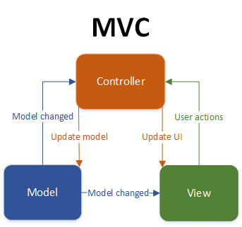

# Inventory Management System Enterprise (IM SE)
 - Software Architecture Document

## Table of contents
- [Table of contents](#table-of-contents)
- [Introduction](#1-introduction)
    - [Purpose](#11-purpose)
    - [Scope](#12-scope)
    - [Definitions, Acronyms and Abbreviations](#13-definitions-acronyms-and-abbreviations)
    - [References](#14-references)
    - [Overview](#15-overview)
- [Architectural Representation](#2-architectural-representation)
- [Architectural Goals and Constraints](#3-architectural-goals-and-constraints)
- [Use-Case View](#4-use-case-view)
   - [Use-Case Realizations](#41-use-case-realization)
- [Logical View](#5-logical-view)
- [Process View](#6-process-view)
- [Deployment View](#7-deployment-view)
- [Implementation View](#8-implementation-view)
- [Data View](#9-data-view)
- [Size and Performance](#10-size-and-performance)
- [Quality](#11-quality)

## 1. Introduction
### 1.1 Purpose
This document provides a comprehensive architectural overview of the system, using a number of different architectural views to depict different aspects of the system. It is intended to capture and convey the significant architectural decisions which have been made on the system.

### 1.2 Scope
The goal of this SAD is to show the architecture of our inventory management program, which we implemented as a desktop application. We show an overview of our use cases and classes.

### 1.3 Definitions, Acronyms and Abbreviations
| Abbrevation | Explanation                            |
| ----------- | -------------------------------------- |
| SRS         | Software Requirements Specification    |
| UC          | Use Case                               |
| n/a         | not applicable                         |
| tbd         | to be determined                       |
| UCD         | overall Use Case Diagram               |

### 1.4 References

| Title                                                               | Date       | Publishing organization   |
| --------------------------------------------------------------------|:----------:| ------------------------- |
| [Framgång Blog](https://dhbwse.wordpress.com/blog/)                 | 06.10.2022 | Framgång Team             |
| [GitHub](https://github.com/jan-nie/dhbw-framgang)                  | 06.10.2022 | Framgång Team             |

### 1.5 Overview
[This subsection describes what the rest of the Software Architecture Document contains and explains how the Software Architecture Document is organized.]
This document deals with the representation of our architecture, goals and constraints. Other important points are logical, deployment, implementation and data views.
    
## 2. Architectural Representation
Both the front end (an Android app) and the back end of this project make use of the MVC Pattern (Spring).
As a result, the model (data model, domain-specific classes), view (user interface), and controller (which manages the application) are distinct. The following image illustrates the MVC pattern:  
 
Source: https://www.techyourchance.com/wp-content/uploads/2015/06/MVC_MVP.png

## 3. Architectural Goals and Constraints
[This section describes the software requirements and objectives that have some significant impact on the architecture; for example, safety, security, privacy, use of an off-the-shelf product, portability, distribution, and reuse. It also captures the special constraints that may apply: design and implementation strategy, development tools, team structure, schedule, legacy code, and so on.]

## 4. Use-Case View
[This section lists use cases or scenarios from the use-case model if they represent some significant, central functionality of the final system, or if they have a large architectural coverage—they exercise many architectural elements or if they stress or illustrate a specific, delicate point of the architecture.]

### 4.1 Use-Case Realizations
Use Case: inventory management [here](../use_cases/uc1_inventory_management.md)
Use Case: user role management [here](../use_cases/uc2_user_role_management.md)
Use Case: sell process [here](../use_cases/uc3_sell_process.md)
Use Case: changing ui [here](../use_cases/uc4_changing_ui_settings.md)

## 5 Logical View
We put the focus on the interfaces. Here we agreed on the MVC model as the architectural basis. All communication takes place via specially defined interfaces. For example, each of our controllers communicates with the view via interfaces.
Class diagram [here](../week5/classdiagram.md)

## 6 Process View
Sequence digramm: user role management [here](../use_cases/Sequenz_Diagram_User_Role_Management.png)
The administrator has the option of creating a new user or adjusting the rights of an existing user. The distribution of rights is done via already defined presets (i.e. a buyer needs the rights to see the stock of goods, but is not allowed to change it). The consistency of the data is ensured via a database. 
Sequence digramm: inventory management [here](../use_cases/sequenzDiagram_inventory.png)
The buyer can open the required window via the GUI and can create products there. The data entered is checked for correctness in the controller and then written to the database. 
Sequence digramm: sell process [here](../use_cases/SequenceDiagramSale2.jpg)
A salesperson can create sales orders via the GUI. The goods are displayed together with the stock. He can then enter the desired quantities and save the order. This order is validated in the controller. If the validation is successful, the stock is updated in the database and the order is saved. 

## 7 Deployment View
Deployment diagram: 

## 8 Implementation View
Package diagram: 

## 9 Data View
Database ER-Diagram:

## 10 Size and Performance
As indicated in the project vision, we are developing the software for desktop devices with the common operating systems Windows, Linux and macOS. On the other hand, porting to portable devices such as tablets and smartphones running iOS and Android is not planned.
We also use multiple threads for parallel task processing. While the user interacts with the software, background processes are running, which concern availability, for example (see Section 11).

## 11 Quality
We rely on three eminent tactics for the quality feature Availability: 
- Detect Faults: One of the most important functions is the ping/echo test, whereby the database server is pinged at regular intervals in the background to check availability. In addition, all warnings, error messages and exception outputs are saved in a log file.
- Recover from Faults: If the internet connection fails, entered data is cached locally and synchronized with the database at the next opportunity.
- Prevent Faults: User input is processed as part of sanity checking. Data types are checked and adjusted if necessary, and the connection to the database is made exclusively using the interfaces to prevent SQL injections.

