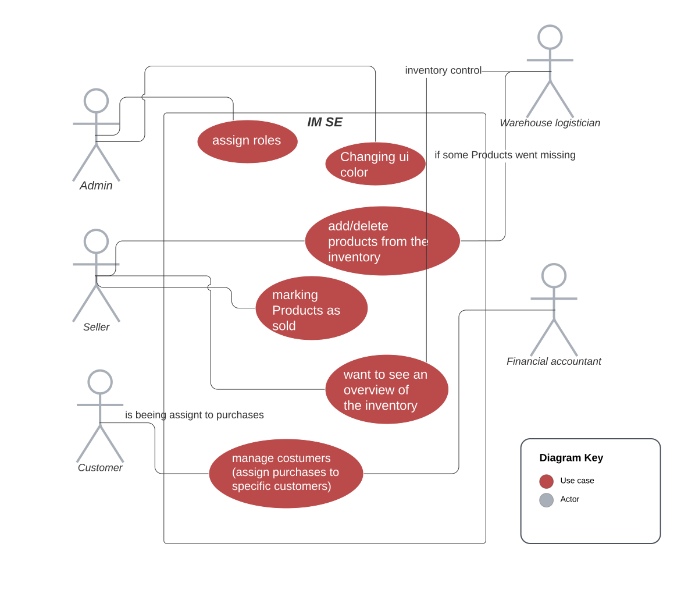

# Inventory Management System Enterprise (IM SE)
 - Software Requirements Specification 

## Table of contents
- [Table of contents](#table-of-contents)
- [Introduction](#1-introduction)
    - [Purpose](#11-purpose)
    - [Scope](#12-scope)
    - [Definitions, Acronyms and Abbreviations](#13-definitions-acronyms-and-abbreviations)
    - [References](#14-references)
    - [Overview](#15-overview)
- [Overall Description](#2-overall-description)
    - [Vision](#21-vision)
    - [Use Case Diagram](#22-use-case-diagram)
	- [Technology Stack](#23-technology-stack)
- [Specific Requirements](#3-specific-requirements)
    - [Functionality](#31-functionality)
    - [Usability](#32-usability)
    - [Reliability](#33-reliability)
    - [Performance](#34-performance)
    - [Supportability](#35-supportability)
    - [Design Constraints](#36-design-constraints)
- [Supporting Information](#4-supporting-information)

### 1.1 Purpose
This Software Requirements Specification (SRS) describes all specifications for the application “IM SE”. 
It includes an overview about this project and its vision, detailed information about the planned features and boundary conditions of the development process.

### 1.2 Scope
The project is going to be realized as a desktop application.

Planned Subsystems are: 
* Scanner:  
detect and add products using an externally connected scanner
* Export:  
inventory or individual product groups can be exported as .csv file
* User roles:  
permissions of individual user groups can be regulated individually
* Corporate design:  
individualization of the user interface to match the company color and logo
* Customer management:  
customers and suppliers can be created and managed

### 1.3 Definitions, Acronyms and Abbreviations
| Abbrevation | Explanation                            |
| ----------- | -------------------------------------- |
| SRS         | Software Requirements Specification    |
| UC          | Use Case                               |
| n/a         | not applicable                         |
| tbd         | to be determined                       |
| UCD         | overall Use Case Diagram               |

### 1.4 References

| Title                                                              | Date       | Publishing organization   |
| -------------------------------------------------------------------|:----------:| ------------------------- |
| [Framgång Blog](https://dhbwse.wordpress.com/blog/)                | 06.10.2022 | Framgång Team             |
| [GitHub](https://github.com/jan-nie/dhbw-software-engineering)     | 06.10.2022 | Framgång Team             |

### 1.5 Overview
The following chapter provides an in-depth overview of this project, presenting a comprehensive vision and an Overall Use Case Diagram to illustrate the project's scope and objectives. It serves as a guiding reference for understanding the project's overall structure and purpose.

Moving forward, the third chapter, titled "Requirements Specification," delves into the specific requirements that need to be met in order to achieve the desired functionality, usability, and design parameters. This chapter offers a detailed examination of the project's technical and non-technical requirements, outlining the necessary features, performance expectations, and user experience considerations.

Additionally, the documentation includes a dedicated chapter that encompasses supplementary information to complement the preceding chapters. This section may contain supporting materials such as references, glossaries, appendices, or other relevant resources that enhance the understanding and implementation of the project. By including this chapter, the documentation ensures that all necessary information is readily available to support the project's successful execution and subsequent maintenance.

## 2. Overall Description

### 2.1 Vision
Our team is currently dedicated to the development of an inventory management system, utilizing the Java programming language, which offers compatibility with a wide range of operating systems. By adopting a modular programming approach, we prioritize efficient inventory management practices. This approach encompasses two primary aspects: the recording and categorization of goods, as well as the assignment of specific attributes to each product, such as storage location, quantity, and price.

To ensure data consistency across multiple devices, we have implemented synchronization functionality using a cloud-based mongoDB. This enables seamless data exchange and updates among different devices accessing the inventory management system.

One of the significant advantages of our modular programming approach is its flexibility and adaptability. It allows for the expansion of software functionalities in a versatile and agile manner. Additionally, the modular structure facilitates task delegation within our team, enabling us to work more efficiently and effectively towards achieving project milestones.

### 2.2 Use Case Diagram 

- Red: Use case
- Grey: Actor

### 2.3 Technology Stack
The technology we use is:

Backend:
Maven
1. Dependency management
2. Build automation
3. Consistent project structure
4. Dependency versioning
5. Centralized repository

MongoDb Database
1. Flexibility: Dynamic schema, accommodating changes in data models
2. Scalability: Horizontal scaling through sharding
3. Document-oriented storage: JSON-like documents for efficient data handling
4. High availability: Replica sets for automatic failover
5. Easy integration and development: Seamless integration with popular languages and frameworks

Frontend:
Java
1. Platform Independence
2. Object-Oriented Programming
3. Robust and Secure
4. Rich Standard Library
5. Strong Community and Support

JavaFX
1. Rich GUI Framework
2. Cross-platform Compatibility
3. Scene Graph
4. CSS Styling
5. Multimedia Support

IDE:
Eclipse
1. Robust Java Development Environment
2. Advanced Code Editing and Refactoring Tools
3. Seamless Integration with Java Development Kit (JDK)

Project Management:
YouTrack 
1. Efficiency
2. Collaboration
3. Transparency

Discord
1. Real-time
2. Multimedia
3. Community

GitHub
1. Version control
2. Collaboration
3. Open-source

Testing:
Unit
1. Automation
2. Integration
3. Organization
4. Coverage
5. Reporting

## 3. Specific Requirements

### 3.1 Functionality
This section will explain the different use cases, you could see in the Use Case Diagram, and their functionality.  
- 3.1.1 Inventory management
- 3.1.2 User role management
- 3.1.3 Customer management
- 3.1.4 Sell process
- 3.1.5 Changing UI settings

#### 3.1.1 Inventory management
This function is crucial to our project as it empowers authorized users with the ability to manage products. They can create new products, modify product-specific properties, and delete products as needed.

[Use Case 1: Inventory management](./use_cases/uc1_inventory_management.md)

#### 3.1.2 Overview products
This feature offers a concise overview of all ongoing sessions, including all posted sessions. Users can easily browse through this overview and select a specific session of interest to join.

#### 3.1.3 User role management
To ensure user identification, an account system is essential. This system serves as a foundation for crucial functions like joining and leaving sessions, as well as providing a personalized overview of all sessions. Users can conveniently keep track of their own sessions through this feature.

[Use Case 2: User role management](./use_cases/uc2_user_role_management.md)

#### 3.1.4 Customer management
Implementing a customer management system streamlines operations, enhances customer relationships, and enables personalized marketing and exceptional service. It improves efficiency, collaboration, and customer satisfaction, ultimately driving business growth and staying competitive in the market.

#### 3.1.5 Sell process
Implementing a sales management system optimizes the selling process, streamlines operations, improves productivity, and enhances customer satisfaction. It provides valuable insights, enables data-driven decision-making, and drives revenue growth, ensuring competitiveness in the market.

[Use Case 3: Sell process](./use_cases/uc3_sell_process.md)

#### 3.1.6 Changing UI settings
Implementing the option to change UI settings, such as the color scheme, is crucial for personalization, accessibility, emotional impact, branding consistency, user satisfaction, and inclusivity. It empowers users, accommodates diverse needs, fosters positive connections, and ensures long-term relevance.

[Use Case 4: Changing UI settings](./use_cases/uc4_changing_ui_settings.md)

### 3.2 Usability
We are committed to designing a user interface that is exceptionally intuitive and self-explanatory, prioritizing the comfort of our users throughout their interaction with the app. While we will provide an FAQ document for additional support, our primary goal is to create an interface so seamlessly designed that users won't find it necessary to rely on external resources. We want every user to feel empowered and confident while using our app, effortlessly navigating its features and functionalities.

### 3.3 Reliability

#### 3.3.1 Availability
Considering that productive work relies on server accessibility, ensuring a minimum uptime of 99% is crucial. To guarantee this level of availability, we have partnered with MongoDB, a trusted provider renowned for their reliable services. MongoDB offers a backup server solution, providing an added layer of assurance that our system remains accessible and operational even in unforeseen circumstances. With this partnership in place, we prioritize uninterrupted productivity, enabling users to confidently rely on our platform without concerns about server downtime.

### 3.4 Perfomance

#### 3.4.1 Capacity
Our system is designed to efficiently handle a high volume of requests, capable of managing hundreds of simultaneous user interactions without compromising performance or responsiveness. Furthermore, we have ensured scalability by allowing for unlimited user registrations and product additions. Regardless of the number of users or products, our system can accommodate the growth and demands of your business seamlessly. You can confidently expand your user base and product catalog, knowing that our platform is equipped to handle the increasing demands without any limitations or constraints. 

#### 3.4.2  Response time
To ensure an exceptional user experience, one of our primary goals is to maintain impressively low response times. We recognize that speedy and efficient interactions are vital for user satisfaction and engagement. By optimizing our system's performance and minimizing response times, we aim to create a seamless and hassle-free user experience. Our dedication to delivering swift response times reflects our commitment to prioritizing user-centric design and enhancing overall user satisfaction.

### 3.5 Supportability

#### 3.5.1 Coding Standards
Adhering to clean code standards is crucial for our development process. By using descriptive names for variables and methods based on their functionalities, we ensure code readability and facilitate easier collaboration. This leads to improved maintainability, scalability, and efficient development iterations. Investing in clean coding practices sets the foundation for a robust and adaptable codebase.

#### 3.5.2 Testing Strategy
Ensuring a high test coverage is a top priority for our application. We are committed to thoroughly testing all critical functionalities and edge cases to detect any mistakes in the implementation. By conducting comprehensive testing, we can identify errors promptly and locate their source with ease. This approach enables us to maintain a robust and reliable application, delivering a seamless user experience while minimizing the risk of potential issues. By investing in extensive testing, we prioritize quality assurance and guarantee a solid foundation for our application's functionality and performance.

### 3.6 Design Constraints
Our aim is to deliver a modern and user-friendly design for both the UI and the architecture of our application. To achieve this, we prioritize a modular approach when designing functionalities. By keeping the functionalities modular, we ensure flexibility and scalability, allowing for easier maintenance, updates, and enhancements. This approach also promotes reusability, as modular components can be easily integrated into different parts of the application, saving time and effort in development. Ultimately, our focus on a modular design contributes to a seamless user experience, a streamlined development process, and a future-proof application architecture.

The supported Platforms will be:
Java 17 and higher
Upgrading to Java 17 or higher brings improved performance, enhanced language features, increased security, long-term support, and access to a thriving developer community. It's a valuable investment for your software projects.

### 3.7 Purchased Components
We don't have any purchased components yet. If there will be purchased components in the future we will list them here.

### 3.8 Interfaces

#### 3.8.1 User Interfaces
The User interfaces that will be implented are:
- Dashboard - overview of important informations
- Login - this page is used to log in 
- Register - provides a registration form (can be used by Admin)
- Inventory Overview - lists all products and their essential data
- Settings - shows the settings
- Supplier - lists all suppliers and their essential data

#### 3.8.2 Hardware Interfaces
(n/a)

#### 3.8.3 Software Interfaces
The application will be runnable on Java 17 and higher.  

### 3.9 Licensing Requirements

### 3.10 Applicable Standards
The development will follow the common clean code standards and naming conventions. 

## 4. Supporting Information
For any further information you can contact us or check our [Blog](https://dhbwse.wordpress.com/blog/). 
The Team Members are:
- Jan Niederhoefer
- Dominik Fuchs
- Mika Wohlfart
- Marius Hoffmann
- Nicolai Eisenstein

<!-- Picture-Link definitions: -->
