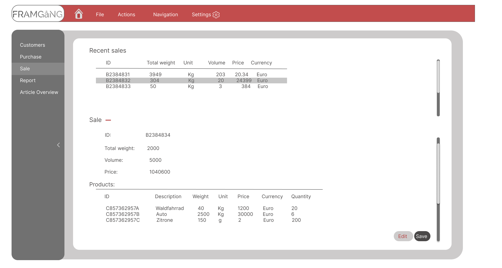

# Use-Case Specification: Sell Process

# 1. Getting an overview

## 1.1 Brief Description
The inventory management software includes a specialized "Sell Process" use-case designed to streamline the handling of telephone orders received by a salesman. This feature ensures a seamless and efficient process for managing sales activities that involve order placement via telephone.  

With the software, salesmen can easily record and process customer orders received over the phone, capturing all necessary details accurately. These telephone orders are consolidated and recorded in a centralized system, enabling easy access and retrieval of order information whenever needed.
   
   

## 1.2 Mockup

   
   

# 2. Flow of Events

## 2.1 Basic Flow
The "Sell Process" use-case in the inventory management software offers a straightforward and user-friendly basic flow. It can be divided into the following substeps:
   

- User Navigation:  
  Upon launching the application, the user is automatically directed to the dashboard, which serves as the main page of the app. This ensures a seamless and efficient start to the selling process.
   

- Session List Display:  
  On the dashboard, the user is presented with a clear and comprehensive list of all existing sessions. This list provides an overview of the ongoing selling activities and enables the user to easily identify and access the relevant sessions.  
   

By providing a centralized dashboard as the initial landing page, the software ensures that users can quickly and conveniently access the information they need. The session list display further enhances efficiency by providing a clear snapshot of the ongoing selling sessions, enabling users to manage and prioritize their selling activities effectively.
   
   

### Activity Diagram

   

The "Sales via Phone Call" activity diagram outlines the basic steps involved in handling sales transactions between a customer and a salesman through telephone calls. The process begins with the customer initiating a call and ends with the finalization of the order. The salesman collects customer information, provides product details, checks inventory availability, creates the order and processes payment. Throughout the process, the inventory list resource is utilized to ensure product availability. This activity diagram provides a high-level overview of the sales process, demonstrating how the software facilitates smooth and efficient transactions via phone calls.  
   
   

### Sequence Diagram

   
   

## 2.2 Alternative Flows
n/a
   
   

# 3. Special Requirements
n/a
   
   

# 4. Preconditions
The Preconditions for this use case are:
1. The user has started the App
2. The user has navigated to the dashboard (after the startup the dashboard is per default the displayed page)
3. At least one sessions was alredy posted
   
   

# 5. Postconditions
n/a
   
   

### 5.1 Save changes / Sync with server
The inventory management software ensures that the displayed data is updated whenever the user enters the dashboard again or manually refreshes the page. This functionality guarantees that users have access to the most up-to-date information, enabling them to make informed decisions based on the latest data available. By automatically updating the displayed data upon revisiting the dashboard or manual page refresh, users can rely on accurate information without the need for manual actions.  
   
   

# 6. Function Points
Total number of story points: 8
