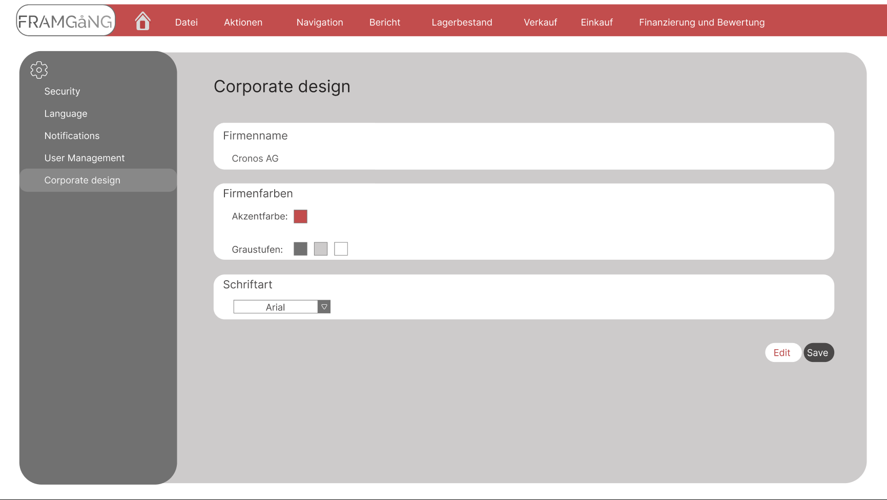
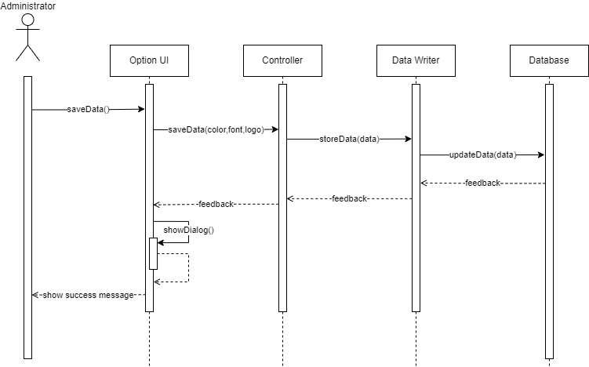

# Use-Case Specification: Changing UI settings

# 1. Getting an overview

## 1.1 Brief Description
A user with the Administrator role should be able to change the color palette of the user interface from the generic colors to specific colors that match the corporate identity. It should be possible to change the grayscale used and an accent color. It should also be possible to change the font to further customize the UI to the cooperate design. 
   
   

## 1.2 Mockup

   
   

## 1.3 Screenshot

   
   

# 2. Flow of Events

## 2.1 Basic Flow
- The administrator navigates to the settings
- The administrator must then select the Corporate Design tab.
- Here the administrator has the possibility to adjust the accent color and to set the gray levels of the ui
- In the same tab it is also possible to change the font.
   
   

### Activity Diagram

   
   

### Sequence Diagram

   
   

## 2.2 Alternative Flows
n/a
   
   

# 3. Special Requirements
- To change the cooperate design, the user must have the administrative role.
   
   

# 4. Preconditions
The requirements for this use case are:
1. The user has launched the application
2. The user has navigated to Preferences
3. User has an existing database connection
4. The user is an admin
   
   

# 5. Postconditions
The updated design must be stored in the database and displayed and applied to all users
   
   

### 5.1 Save changes / Sync with server
The selected theme should be updated every few seconds as changes are made.
   
   

# 6. Function Points
Total number of function points: 5
