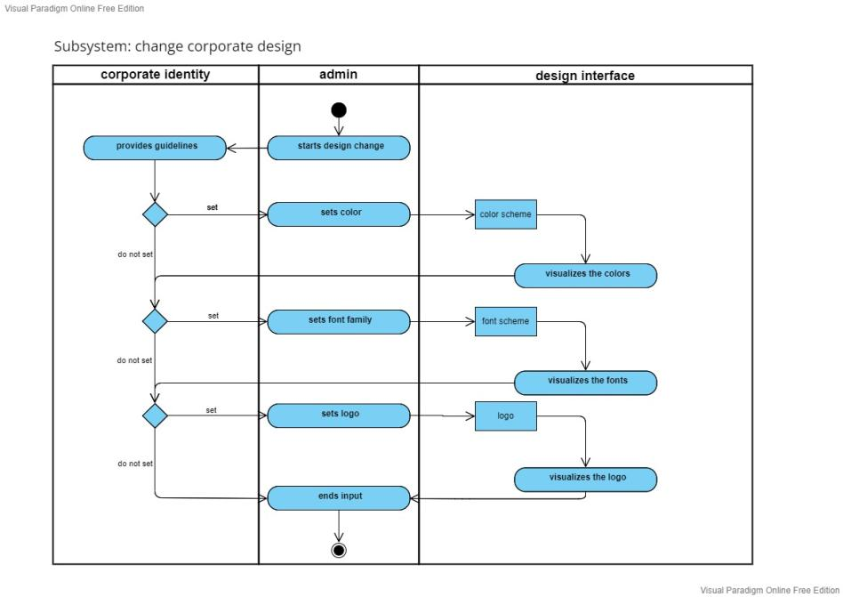

# Use-Case Specification: Changing UI settings

# 1. Getting an overview

## 1.1 Brief Description
The company administrator has the possibility to change the colour palette of the UI for the company. He also has the possibility to add the name of the company to the UI and thus personalise the IMSE.

## 1.2 Mockup

## 1.3 Screenshot
see 1.2

# 2. Flow of Events

## 2.1 Basic Flow
- The Admin navigates to the settings
- then the admin must select the Corporate Design tab
- Here the admin has the option to enter the company name. Adjust the accent colour and store the grey levels. 
- He can also adjust the font here

### Activity Diagram

### Sequence Diagram

## 2.2 Alternative Flows
n/a

# 3. Special Requirements
- User roles are assumed 

# 4. Preconditions
The Preconditions for this use case are:
1. The user has started the App
2. The user has navigated to settings
3. The user has an existing database connection
4. The user is an admin

# 5. Postconditions
n/a

### 5.1 Save changes / Sync with server
The displayed data should be updated whenever the user restarts the programm. 

# 6. Function Points
Total number of function points: 5
