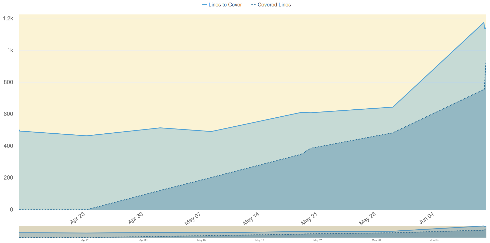
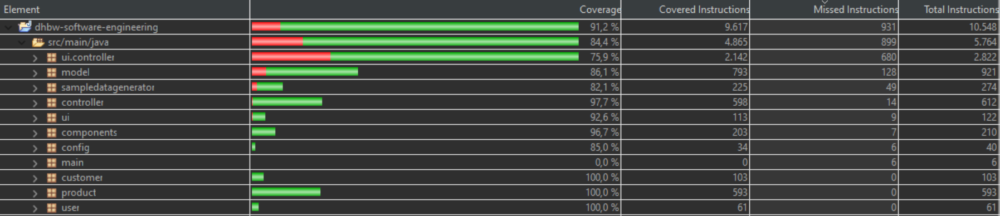

# Software Engineering - Framgång - Test Report

Last published: 2023-06-13 | Version: 1.0-SNAPSHOT

  
  

## Summary

| Tests | Errors | Failures | Skipped | Success rate | Time |
| --- | --- | --- | --- | --- | --- |
| 129 | 0   | 0   | 0   | 100% | 101,734 |

  
  
  
  

  

## Packages

\[[Summary](#summary)\] \[[Packages](#packages)\] \[[Test Cases](#test-cases)\]

  

| Package | Tests | Errors | Failures | Skipped | Success rate | Time |
| --- | --- | --- | --- | --- | --- | --- |
| [controller](#controller) | 11  | 0   | 0   | 0   | 100% | 3,353 |
| [database](#database) | 19  | 0   | 0   | 0   | 100% | 12,729 |
| [product](#product) | 51  | 0   | 0   | 0   | 100% | 5,332 |
| [ui.controller](#uicontroller) | 16  | 0   | 0   | 0   | 100% | 66,253 |
| [ui](#ui) | 2   | 0   | 0   | 0   | 100% | 3,091 |
| [model](#model) | 9   | 0   | 0   | 0   | 100% | 9,557 |
| [sampledatagenerator](#sampledatagenerator) | 1   | 0   | 0   | 0   | 100% | 0,008 |
| [config](#config) | 2   | 0   | 0   | 0   | 100% | 1,314 |
| [customer](#customer) | 18  | 0   | 0   | 0   | 100% | 0,097 |

  
  

### controller

|     | Class | Tests | Errors | Failures | Skipped | Success rate | Time |
| --- | --- | --- | --- | --- | --- | --- | --- |
|  | [CSVControllerTest](#csvcontrollertest) | 4   | 0   | 0   | 0   | 100% | 3,181 |
|  | [CSVImportModelTest](#csvimportmodeltest) | 2   | 0   | 0   | 0   | 100% | 0,018 |
|  | [DatabaseControllerTest](#databasecontrollertest) | 5   | 0   | 0   | 0   | 100% | 0,154 |

  
  

### database

|     | Class | Tests | Errors | Failures | Skipped | Success rate | Time |
| --- | --- | --- | --- | --- | --- | --- | --- |
|  | [DbTest](#dbtest) | 19  | 0   | 0   | 0   | 100% | 12,729 |

  
  

### product

|     | Class | Tests | Errors | Failures | Skipped | Success rate | Time |
| --- | --- | --- | --- | --- | --- | --- | --- |
|  | [ControllerProductTest](#controllerproducttest) | 1   | 0   | 0   | 0   | 100% | 0,008 |
|  | [GoodsEntranceTest](#goodsentrancetest) | 16  | 0   | 0   | 0   | 100% | 1,624 |
|  | [GoodsOutgoingTest](#goodsoutgoingtest) | 9   | 0   | 0   | 0   | 100% | 1,699 |
|  | [ProductTest](#producttest) | 23  | 0   | 0   | 0   | 100% | 1,996 |
|  | [SupplierTest](#suppliertest) | 2   | 0   | 0   | 0   | 100% | 0,005 |

  
  

### ui.controller

|     | Class | Tests | Errors | Failures | Skipped | Success rate | Time |
| --- | --- | --- | --- | --- | --- | --- | --- |
|  | [IMSESceneControllerTest](#imsescenecontrollertest) | 16  | 0   | 0   | 0   | 100% | 66,253 |

  
  

### ui

|     | Class | Tests | Errors | Failures | Skipped | Success rate | Time |
| --- | --- | --- | --- | --- | --- | --- | --- |
|  | [MainFXTest](#mainfxtest) | 2   | 0   | 0   | 0   | 100% | 3,091 |

  
  

### model

|     | Class | Tests | Errors | Failures | Skipped | Success rate | Time |
| --- | --- | --- | --- | --- | --- | --- | --- |
|  | [CorporateDesignTest](#corporatedesigntest) | 1   | 0   | 0   | 0   | 100% | 0,002 |
|  | [DatabaseModelTest](#databasemodeltest) | 8   | 0   | 0   | 0   | 100% | 9,555 |

  
  

### sampledatagenerator

|     | Class | Tests | Errors | Failures | Skipped | Success rate | Time |
| --- | --- | --- | --- | --- | --- | --- | --- |
|  | [ProductGeneratorTest](#productgeneratortest) | 1   | 0   | 0   | 0   | 100% | 0,008 |

  
  

### config

|     | Class | Tests | Errors | Failures | Skipped | Success rate | Time |
| --- | --- | --- | --- | --- | --- | --- | --- |
|  | [ConfigTest](#configtest) | 2   | 0   | 0   | 0   | 100% | 1,314 |

  
  

### customer

|     | Class | Tests | Errors | Failures | Skipped | Success rate | Time |
| --- | --- | --- | --- | --- | --- | --- | --- |
|  | [AddressTest](#addresstest) | 13  | 0   | 0   | 0   | 100% | 0,044 |
|  | [ControllerCustomerTest](#controllercustomertest) | 1   | 0   | 0   | 0   | 100% | 0,043 |
|  | [CustomerTest](#customertest) | 4   | 0   | 0   | 0   | 100% | 0,01 |

  
  
  
  

## Test Cases

\[[Summary](#summary)\] \[[Packages](#packages)\] \[[Test Cases](#test-cases)\]

### ConfigTest

|     |     |     |
| --- | --- | --- |
|  | testPrivateConstructor | 1,25 |
|  | testConfigProperties | 0,006 |

  
  

### CSVControllerTest

|     |     |     |
| --- | --- | --- |
|  | testReadListOfProducts | 3,131 |
|  | testWriteToCsv | 0,009 |
|  | testWriteToCsvWithProductList | 0,004 |
|  | testImportProductsInDatabase | 0,019 |

  
  

### CSVImportModelTest

|     |     |     |
| --- | --- | --- |
|  | testReadListOfProducts | 0,008 |
|  | testBuildAProduct | 0,002 |

  
  

### DatabaseControllerTest

|     |     |     |
| --- | --- | --- |
|  | testAddUser_UserDoesNotHaveRights | 0,133 |
|  | testDeleteUser_UserDoesNotHaveRights | 0,003 |
|  | testGetCorporateDesign | 0,005 |
|  | testGetUserRights | 0,004 |
|  | testGetUser | 0,001 |

  
  

### AddressTest

|     |     |     |
| --- | --- | --- |
|  | testSetCountry | 0,003 |
|  | testGetPostalcode | 0,001 |
|  | testGetCity | 0,001 |
|  | testSetPostalcode | 0,001 |
|  | testSetHousNo | 0,001 |
|  | testSetOthers | 0,005 |
|  | testGetHousNo | 0,002 |
|  | testSetStreet | 0,001 |
|  | testGetCountry | 0,001 |
|  | testGetOthers | 0,001 |
|  | testGetStreet | 0,001 |
|  | testSetCity | 0,004 |
|  | testAddressConstructor | 0,003 |

  
  

### ControllerCustomerTest

|     |     |     |
| --- | --- | --- |
|  | testAddCustomer | 0,042 |

  
  

### CustomerTest

|     |     |     |
| --- | --- | --- |
|  | testGetAddress | 0,001 |
|  | testGetName | 0,001 |
|  | testSetAddress | 0,001 |
|  | testSetName | 0,001 |

  
  

### DbTest

|     |     |     |
| --- | --- | --- |
|  | validateUserIncorrectUsername | 2,191 |
|  | getCustomer | 0,001 |
|  | validateUserCorrectInput | 0,394 |
|  | getDataForProductOverview | 0,426 |
|  | CSVExport | 0,002 |
|  | testEditUserRight | 1,744 |
|  | testEditUserWrong | 0,631 |
|  | UpdateCorporateDesign | 0,591 |
|  | readCSVFile | 0,002 |
|  | testGetAllUser | 1,424 |
|  | validateUserIncorrectPassword | 0,246 |
|  | updateColorScheme | 1,083 |
|  | getUser | 0,236 |
|  | testGetDatabaseData | 0,272 |
|  | testAddUserNew | 0,941 |
|  | testAddUserOld | 1,227 |
|  | getUserRights | 0,001 |
|  | testDeleteUserNew | 0,243 |
|  | testDeleteUserOld | 1,054 |

  
  

### CorporateDesignTest

|     |     |     |
| --- | --- | --- |
|  | testCorporateDesign | 0,001 |

  
  

### DatabaseModelTest

|     |     |     |
| --- | --- | --- |
|  | testAddUserExisting | 1,29 |
|  | testGetAllUser | 1,387 |
|  | testGetUser | 0,237 |
|  | testDeletUserNew | 0,224 |
|  | testDeletUserOld | 1,943 |
|  | testInsertNewProducts | 0,255 |
|  | testAddUserNew | 2,97 |
|  | testUserEditRight | 1,245 |

  
  

### ControllerProductTest

|     |     |     |
| --- | --- | --- |
|  | testConstructor | 0,007 |

  
  

### GoodsEntranceTest

|     |     |     |
| --- | --- | --- |
|  | testDatabaseNameSetter | 0,001 |
|  | testChangedProductsGetter | 0   |
|  | testChangedProductsSetter | 0,004 |
|  | testVolumeGetter | 0,001 |
|  | testDatabaseControllerSetter | 0,001 |
|  | testVolumeSetter | 0,001 |
|  | testParseToDocument | 0,087 |
|  | testIdGetter | 0,001 |
|  | testIdSetter | 0,001 |
|  | testGetterSetter | 0,001 |
|  | testWeightGetter | 0,001 |
|  | testWriteEntranceInDatabase | 1,509 |
|  | testPriceGetter | 0   |
|  | testWeightSetter | 0   |
|  | testPriceSetter | 0,001 |
|  | testDatabaseNameGetter | 0,001 |

  
  

### GoodsOutgoingTest

|     |     |     |
| --- | --- | --- |
|  | testChangedProductsGetterAndSetter | 0,002 |
|  | testVolumeGetterAndSetter | 0,001 |
|  | testParseToDocument | 0,003 |
|  | testPriceGetterAndSetter | 0   |
|  | testWriteSellingInDatabase | 1,68 |
|  | testDatabaseNameGetterAndSetter | 0,001 |
|  | testIdGetterAndSetter | 0,001 |
|  | testDatabaseControllerGetterAndSetter | 0   |
|  | testWeightGetterAndSetter | 0,001 |

  
  

### ProductTest

|     |     |     |
| --- | --- | --- |
|  | testGetPrice | 0,001 |
|  | testParseProductToDocument | 0   |
|  | testToString_WithoutAdditionalInformationMap | 0,007 |
|  | testGetAdditionalInformationMap | 0,001 |
|  | testGetId | 0,002 |
|  | updateAProductCompleteWorkflowForSelling | 1,029 |
|  | testToString_WithEmptyAdditionalInformationMap | 0,001 |
|  | testParseProductToDocument_WithAdditionalInformation | 0   |
|  | testParseProductToDocument_WithEmptyAdditionalInformationMap | 0   |
|  | testAdditionalInformationMapGetterAndSetter | 0,001 |
|  | testProductToCSVString | 0,001 |
|  | testPriceGetterAndSetter | 0,001 |
|  | testToDocument | 0   |
|  | testGetQuantity | 0   |
|  | testDescriptionGetterAndSetter | 0   |
|  | testParseProductToDocument_WithNullAdditionalInformationMap | 0,001 |
|  | updateAProductInModelForSelling | 0,93 |
|  | testParseProductToDocument_WithoutAdditionalInformationMap | 0   |
|  | testToString_WithAdditionalInformation | 0,001 |
|  | testGetDescription | 0,002 |
|  | testQuantityGetterAndSetter | 0,001 |
|  | testToString_WithNullAdditionalInformationMap | 0,001 |
|  | testIdGetterAndSetter | 0   |

  
  

### SupplierTest

|     |     |     |
| --- | --- | --- |
|  | testConstructorAndGetters | 0,002 |
|  | testSetters | 0   |

  
  

### ProductGeneratorTest

|     |     |     |
| --- | --- | --- |
|  | testGenerateRandomProduct | 0,004 |

  
  

### IMSESceneControllerTest

|     |     |     |
| --- | --- | --- |
|  | testPurchase | 11,414 |
|  | testLoginWithValidCredentials | 3,755 |
|  | testLoadPane(String, String, String)\[1\] | 2,885 |
|  | addAndDeleteUser | 8,511 |
|  | testSale | 6,707 |
|  | testLoadMenuBar | 0,686 |
|  | testGetGrayscale | 3,525 |
|  | showCorporateDesignSettingPane(String, String, String)\[1\] | 2,367 |
|  | testShowAddProductScene | 2,93 |
|  | testSidebarForDashboardIsNull | 1,388 |
|  | testLoadTabForSidebars(String, String)\[1\] | 0,998 |
|  | refresh | 1,601 |
|  | editProduct | 6,041 |
|  | addProduct | 6,297 |
|  | editUser | 4,098 |
|  | testLoginWithInvalidCredentialsShowsErrorMessage | 2,873 |

  
  

### MainFXTest

|     |     |     |
| --- | --- | --- |
|  | testApplicationExit | 1,731 |
|  | testIconSetup | 1,355 |

  
  

## Coverage
  
The figure above shows the progress of the code base during the entire duration of the project, as well as the test coverage. At the end of the project, we had 1.142 lines to cover, of which we covered 939 lines with unit tests. This results in a test coverage of 81.0%.  
   
   

  

The figure above shows the test coverage of the unit tests in Eclipse. As can be seen, all packages were covered by tests and the coverage is between 75% and 100% per package. The test coverage was calculated in Eclipse and therefore differs slightly from the calculated metric from Sonarqube, as the lines to be covered are defined differently.  
   
The detailed view of the coverage of the individual methods was compiled as a [JaCoCo report](coverage.zip). This can be downloaded, unzipped and the included index.html file opened in any browser. From this, it is possible to navigate to the individual packages and methods.  
   
   

